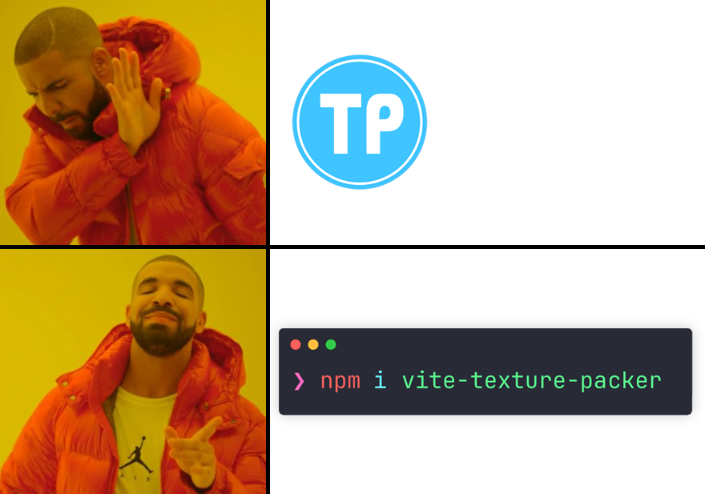

# vite-texture-packer

[English](./README.md) | [Русский](./README_RU.md)

`vite-texture-packer` — это плагин для Vite, который автоматически сканирует директории со спрайтами и упаковывает их в атласы. Плагин совместим с Phaser и PixiJS.



## Установка

```bash
npm i vite-texture-packer
```

## Использование

```ts
import { defineConfig } from "vite";
import texturePacker from "vite-texture-packer";

export default defineConfig({
  plugins: [
    texturePacker({
      inputDir: "./textures",
      outputDir: "./public/resources/atlases",
    }),
  ],
});
```

Каждая директория внутри `inputDir` упаковывается независимо. Например, для `./textures/ui/buttons` плагин создаст:

- `public/resources/atlases/ui/buttons/buttons.png`
- `public/resources/atlases/ui/buttons/buttons.json`

## Пример структуры проекта

```text
public
└── resources
    └── atlases
        └── .gitkeep
textures
├── ui
│   ├── MenuIcons
│   │   ├── AchievementsIcon.png
│   │   ├── Chest.png
│   │   └── SettingsIcon.png
│   ├── SocialIcons
│   │   ├── DiscordIcon.png
│   │   ├── GoogleIcon.png
│   │   └── TelegramIcon.png
│   └── Spinner
│       ├── Spinner_0.png
│       ├── Spinner_1.png
│       ├── Spinner_2.png
│       └── Spinner_3.png
└── weapons
    └── GasterBlaster
        ├── GasterBlaster_0.png
        ├── GasterBlaster_1.png
        ├── GasterBlaster_2.png
        └── GasterBlaster_3.png
vite.config.ts
```

Плагин сгенерирует пары atlas-файлов, повторяющие структуру исходных папок:

```text
public
└── resources
    └── atlases
        ├── ui
        │   ├── MenuIcons
        │   │   ├── MenuIcons.png
        │   │   └── MenuIcons.json
        │   ├── SocialIcons
        │   │   ├── SocialIcons.png
        │   │   └── SocialIcons.json
        │   └── Spinner
        │       ├── Spinner.png
        │       └── Spinner.json
        ├── weapons
        │   └── GasterBlaster
        │       ├── GasterBlaster.png
        │       └── GasterBlaster.json
        └── .gitkeep
```

## Опции

```ts
interface TexturePackerOptions {
  inputDir: string;
  outputDir: string;
  width?: number;
  height?: number;
  padding?: number;
  cacheFile?: string;
}
```

| Опция | По умолчанию | Описание |
| --- | --- | --- |
| `inputDir` | обязательна | Папка, в которой лежат исходные изображения для упаковки. Каждая вложенная директория упаковывается в свой atlas. |
| `outputDir` | обязательна | Папка, куда будут записываться сгенерированные `.png` и `.json` файлы, повторяющие структуру `inputDir`. |
| `width` | `2048` | Максимальная ширина одного atlas PNG. Плагин пытается уместить все изображения из одной папки в атлас не шире этого значения. |
| `height` | `2048` | Максимальная высота одного atlas PNG. Плагин пытается уместить все изображения из одной папки в атлас не выше этого значения. |
| `padding` | `2` | Отступ в пикселях между спрайтами внутри атласа. |
| `cacheFile` | `<vite cache dir>/texture-packer.json` | Путь к файлу кэша, который помогает не пересобирать атласы без изменений. |

## Примечания

- `outputDir` не может совпадать с `inputDir` и не может находиться внутри `inputDir`.
- Упаковываются только файлы `png`, `jpg`, `jpeg` и `webp`.
- Если в исходной директории удалить файлы, устаревшие сгенерированные atlas-файлы будут удалены автоматически.
